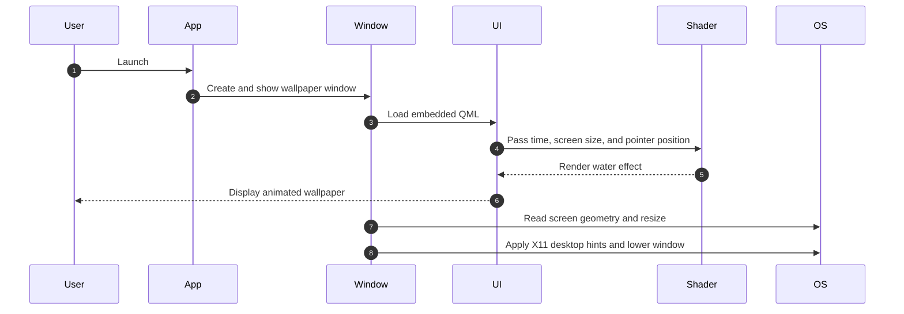

<div align="center">

# FedoraWallpaper

**A lightweight Qt wallpaper app that renders an animated, interactive water shader across a Linux desktop**

[](https://www.linux.org/)
[](https://www.qt.io/)
[](https://isocpp.org/)
[](LICENSE)

</div>

---

## 📌 Problem & Motivation

Static desktop backgrounds offer little motion or interaction, while wallpaper engines are not always available or suitable for Linux desktop setups. FedoraWallpaper is a small Qt application that draws an animated GLSL water effect and adapts its window geometry to connected displays.

The current implementation:

- **Renders** a continuously animated water shader with mouse-responsive distortion.
- **Covers** the combined geometry of detected screens.
- **Uses** Qt Quick for the visual layer and embeds the QML and shader resources in the application.

> **Desktop compatibility:** The window-lowering implementation uses X11 APIs. Native Wayland desktop-layer behavior is not implemented or verified; running under Wayland may require XWayland and is not guaranteed to work as a wallpaper.

---

## ✨ Key Features

- **🎨 Renders** an animated GLSL water effect with dark-blue colors and cyan highlights.
- **🖱️ Responds** to pointer movement through a subtle shader distortion.
- **🖥️ Covers** the union of connected monitor geometries and updates when screens change.
- **📦 Embeds** the QML interface and shader resources in the Qt application.

---

## 🧠 Architecture & How It Works



## 🛠️ Tech Stack

| Category | Technology | Purpose |
|---|---|---|
| UI | Qt 6 Widgets and Qt Quick | Hosts the wallpaper window and QML scene |
| Language | C++17 | Application startup, window management, and monitor handling |
| Graphics | GLSL fragment shader and Qt ShaderTools | Renders and packages the animated water effect |
| Desktop integration | X11 | Sets desktop window hints and lowers the window |
| Build | CMake 3.16+ | Configures and builds the application |

## 🚀 Getting Started

### Prerequisites

- A Linux system with a graphical desktop session.
- CMake 3.16 or newer and a C++17 compiler.
- Qt 6 development packages for Core, Gui, Qml, Quick, Widgets, QuickWidgets, WaylandClient, and ShaderTools.
- X11 development headers and libraries.
- A Qt 6 installation that provides the CMake commands used to compile shader resources.

The application’s X11 window-layering code is not a native Wayland implementation. Install the appropriate dependencies for your Linux distribution and display-server configuration.

### 1. Clone the repository

```bash
git clone https://github.com/coxteen/linux-wallpaper-engine.git
cd linux-wallpaper-engine
```

### 2. Configure and build

```bash
cmake -S FedoraWallpaper -B build
cmake --build build
```

### 3. Run

```bash
./build/FedoraWallpaper
```

The executable may be placed in a generator-specific subdirectory when using a multi-configuration build system. Check the build output if it is not at the path above.

## ⚙️ Configuration

There is no separate configuration file or environment-variable setup. The shader, QML scene, monitor geometry handling, and X11 window behavior are defined in the source files under [`FedoraWallpaper/`](FedoraWallpaper/).

## 📄 License & Author

- **Author:** [Costin Ghiujan](https://github.com/coxteen)
- **License:** Released under the [MIT License](LICENSE).
